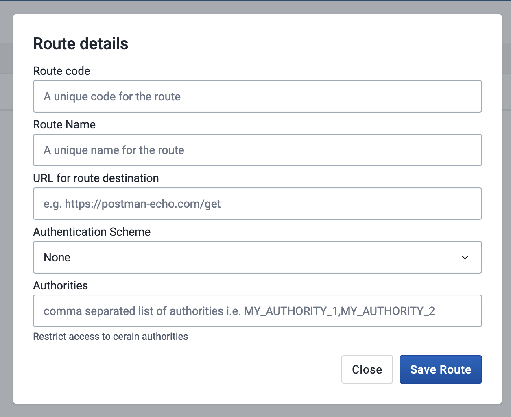
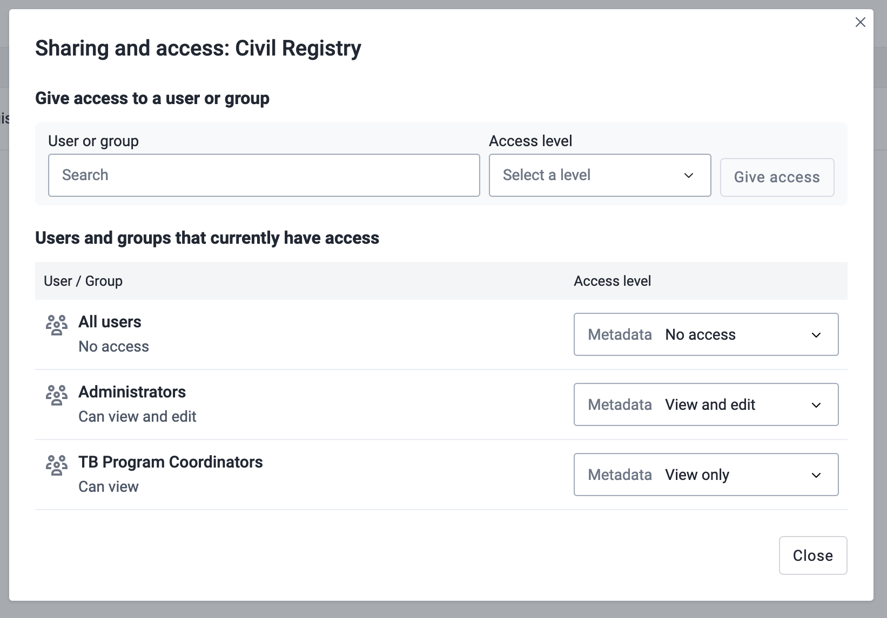

# Route Manager Configuration

To configure the Route for the Civil registry lookup, you will need to add a new Route in the DHIS2 Routes API.  This Route will be used by the Capture App plugin to look up information from the Civil Registry. For this reference implementation, we will use the code `civil-registry` to identify the route. 

We'll be using the [Route Manager App](https://apps.dhis2.org/app/5dbe9ab8-46bd-411e-b22f-905f08a81d78) to configure the Route.  

## Configuration Steps

### Install the Route Manager App from the App Hub

You can find the Route Manager App in the [App Hub](https://apps.dhis2.org/app/5dbe9ab8-46bd-411e-b22f-905f08a81d78). You can choose to download the app from the App Hub and upload it to your DHIS2 instance, or even better, you can install it directly in your DHIS2 instance in the App Management App. 

a. Go to the App Management App in your DHIS2 instance
b. Click on the `App Hub` tab
c. Search for `Route Manager`
d. Click on the `Install` button

### Configure the Route

a. Open the Route Manager App.
b. Click on the `Create new Route` button on the top right of the screen

You'll then be presented with a form to fill out the details of the Route.

c. Fill out the form with the following details:

| Field                 | Value                   | Comments                                                                       |
| --------------------- | ----------------------- | ------------------------------------------------------------------------------ |
| Route Code            | `civil-registry`        | The plugin expects this exact value                                            |
| Name                  | `Civil Registry Lookup` | This name is up to you to decide                                               |
| URL                   | `http://localhost:8080` | The URL configured by the middleware                                           |
| Authentication scheme | `None`                  | The middleware handles Authentication so this can be `None`                    |
| Authorities           | `PLUGIN_USERS`          | Use the authority that represents the users that will interact with the plugin |

d. Click on the `Save Route` button.

### Restrict access

After saving the Route, you can restrict access to the configured route.  This will prevent unauthorized users from editing the Route. To do this, click the `Sharing` button in the Route Manager App on the `civil-registry` route.

You can see an example of the sharing configuration in the screenshot below. This gives access to the `Administrators` user group to view and edit the Route, the TB Program Coordinator user group to view the Route, and "All users" no access. Of course configure this to what matches in your system.

### Test Route
To test the Route, you can use the `Test` button in the Route Manager App. This will send a request to the URL configured in the Route and show the response in the Route Manager App directly. If it is successful, you should see a response from the Civil Registry service.

Next step is to open up the configured capture app and see if the Civil Registry lookup is working as expected.